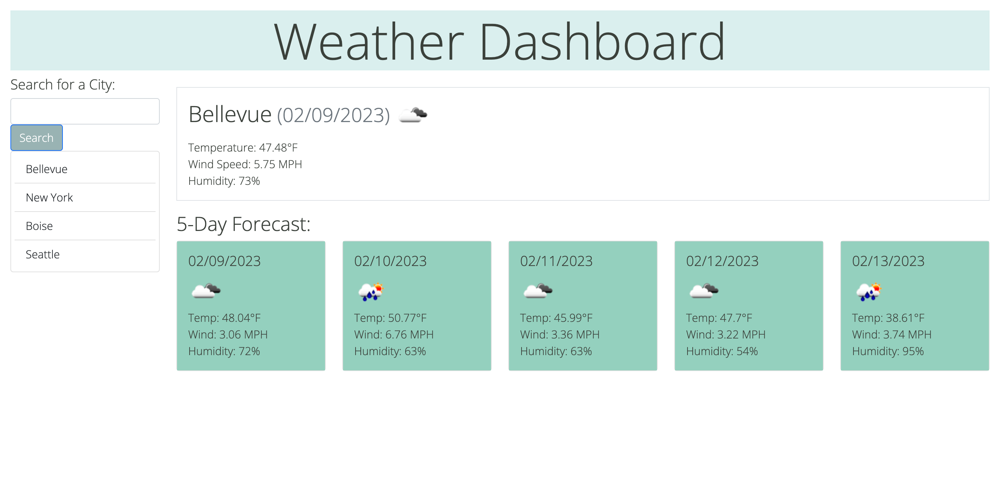

# Weather Dashboard

## Description

This week's challenge allows us to utilize our Server-Side API skills using OpenWeather's 5 Day Weather Forecast API to create an application that lets the user to search for the current and future weather conditions for any city of their liking. 

See below for the direct link to the live page:

[Live Link to Deployed Application](https://linhntran.github.io/weather-dashboard/)

The following image demonstrates what the web application looks like once the user navigates to the live page and searches for the weather. 

